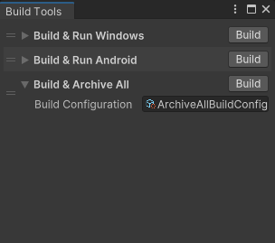

# Build Tools

[](https://unity3d.com/get-unity/download)
[](https://openupm.com/packages/com.chark.build-tools/)
[](https://github.com/chark/build-tools/actions)

Editor utilities for quickly automating builds by utilizing Scriptable Objects.

<p align="center">
  
</p>

:warning: **Warning, this is a preview package, expect breaking changes between releases!**

## Features

- Quickly create build configurations via Scriptable Objects
- Run multiple builds in sequence
- Building archiving
- Odin Inspector support

## Installation

This package can be installed via [OpenUPM](https://openupm.com/packages/com.chark.build-tools):
```text
openupm add com.chark.build-tools
```

Or via the Unity Package Manager by [Installing from a Git URL](https://docs.unity3d.com/Manual/upm-ui-giturl.html):

```text
https://github.com/chark/build-tools.git#upm
```

Alternatively, manually install by adding the following entry to `Packages/manifest.json`:
```json
{
  "com.chark.build-tools": "https://github.com/chark/build-tools.git#upm"
}
```

If you'd like to install a specific release, replace `upm` suffix with version number, e.g., `v0.0.1`. You can find all releases [here](https://github.com/chark/build-tools/releases).

## Links

- [Documentation](../Packages/com.chark.build-tools/Documentation~/README.md)
- [Contributing](CONTRIBUTING.md)
- [Changelog](../Packages/com.chark.build-tools/CHANGELOG.md)
