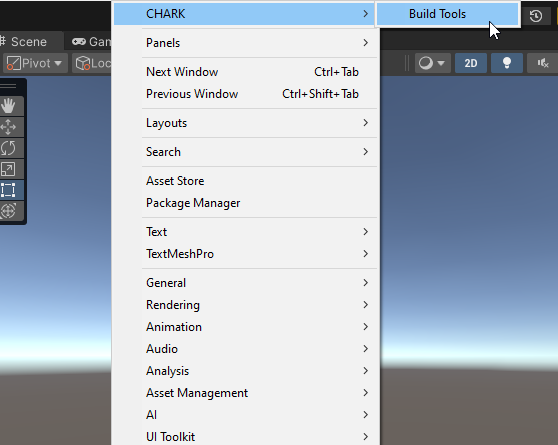

[Unity Package Manager]: https://docs.unity3d.com/Manual/upm-ui.html
[Samples~]: ../Samples%7E
[Defaults Sample]: ../Samples%7E/Defaults
[Changelog]: ../CHANGELOG.md

[Build Tools Window]: ../Editor/BuildToolsManagerWindow.cs
[Build Configuration]: ../Editor/BuildConfiguration.cs

# Documentation

This package provides a set of editor utilities to quickly create builds locally. It allows to build multiple platforms in one click by also ensuring that the naming of the builds is consistent. Additionally, the resulting builds can be automatically started or archived.

## Getting Started

Open [Unity Package Manager], select _Build Tools_ package and import [Defaults Sample]:

  

Open [Build Tools Window] by selecting _Window/CHARK/Build Tools_ menu item. This will open an Editor window which allows you to view all [Build Configuration] assets present in the project:

  

The [Defaults Sample] contains a set of [Build Configuration] assets which showcase _Windows_ and _Android_ builds. Clicking **Build** will next to a configuration will trigger the build process and halt the editor.

If you create new [Build Configuration] assets, they will automatically appear in this window.

**Note**, rearranging entries in this list will only affect your local editor and will not show up in version control.

## Build Configurations

To create a [Build Configuration] asset, right-click anywhere in the _Project Window_ and select _Create/CHARK/Build Tools/Build Configuration_. It is recommended to keep these configuration assets in _Editor_ directory as internally they are working with `UnityEditor` namespace.

  

You can customize this configuration depending on your needs.
